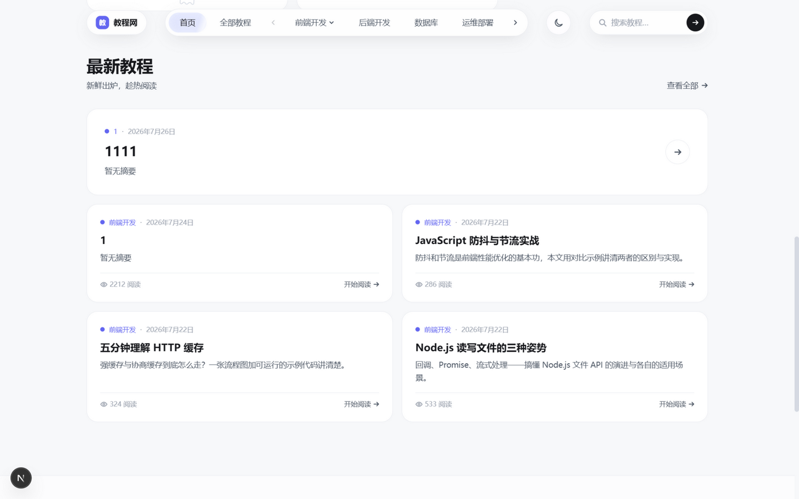
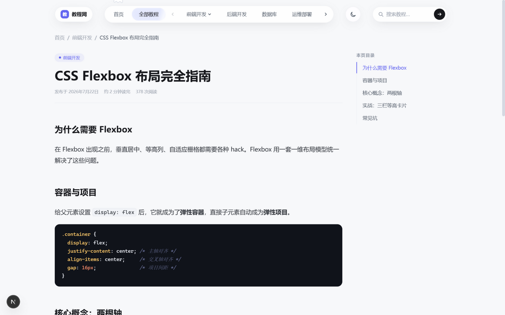
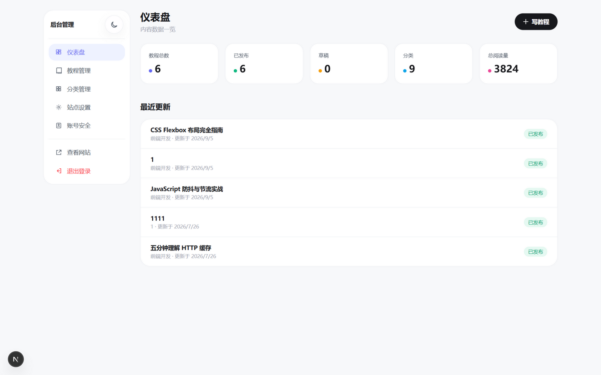

# 教程网

基于 Next.js 16.2（App Router + webpack）、React 19、Tailwind CSS v4、Prisma 7 + SQLite 的图文教程平台。

##免责声明
本站教程仅供个人合法学习研究，严禁用于违法、侵权等行为。用户使用内容产生的一切实操后果自行承担，与本站无关。本站不保证内容绝对无误，有权随时调整内容；
如发现违规，我方保留配合调查的权利。访问本站即同意本声明。
## 项目预览

| 首页（亮色） | 首页（暗色） |
| --- | --- |
|  |  |

| 最新教程 | 文章阅读 |
| --- | --- |
|  |  |

| 管理后台 |
| --- |
|  |

## 功能特性

- **前台**：悬浮胶囊导航（分类翻页、aura/流光动效）、亮暗双主题（跟随手动切换持久化）、鼠标跟随聚光灯卡片与轻微 3D 倾斜、滚动触发的分区渐显、小幽灵吉祥物
- **文章**：服务端 TOC 提取与高亮（highlight.js）、移动端可折叠目录、图片自动注入宽高防布局抖动、上下篇导航
- **后台**：Tiptap 3 富文本编辑器（拖拽/粘贴上传图片）、分类树管理（最多三级、防循环依赖）、站点设置可视化编辑、账号安全
- **SEO 与健壮性**：动态 sitemap / robots、OpenGraph 元信息、真实 404 状态码、越界分页自动收敛、空/加载/错误状态齐全
- **安全**：HMAC 签名会话（`timingSafeEqual` + 密码指纹轮换）、bcrypt(12) 密码、登录限流、上传类型/大小校验与 SVG 消毒、Server Actions 全量鉴权

## 本地运行

```bash
npm ci
npx prisma generate
npx prisma migrate deploy
npx prisma db seed
npm run dev
```

打开 `http://localhost:3000`，后台为 `/admin`。

## 生产部署

服务器要求：Node.js >= 20.9、npm、PM2。推荐使用项目根目录的脚本：

```bash
bash deploy.sh
```

脚本会按“安装依赖 → Prisma generate → migrate → seed → build → PM2 平滑重载”的顺序执行。迁移和种子数据必须在 `npm run build` 之前完成，否则静态主页可能把空数据库内容生成到 `.next` 中。

### 环境变量

在服务器设置 `.env.production`：

```dotenv
DATABASE_URL="file:./prisma/dev.db"
ADMIN_USERNAME="admin"
ADMIN_PASSWORD="请修改为强密码"
# 会话签名密钥：必须替换为随机长字符串（openssl rand -base64 48），
# 使用已知占位值时生产环境会拒绝启动
AUTH_SECRET="请替换为随机长字符串"
# 只有站点全程 HTTPS 时才设为 true；直接用 http://IP:3000 时保持 false
SESSION_COOKIE_SECURE="false"
# 站点对外地址（用于 sitemap / OpenGraph 的绝对链接），如：
# SITE_URL="https://example.com"
SITE_URL="http://localhost:3000"
```

`DATABASE_URL` 的相对路径以项目根目录为基准。PM2 配置已经固定 `cwd`，运行时和 Prisma CLI 会使用同一个数据库文件。

## 管理员账号修改

登录后台后进入侧栏 **账号安全**（`/admin/account`）：

- 修改用户名时需要输入当前密码确认；
- 新密码至少 8 位，可只修改用户名而不改密码；
- 保存后当前浏览器自动换发会话，旧凭据指纹对应的会话会失效。

登录接口内置限流：同一用户名 15 分钟内连续 5 次失败后暂时锁定。
